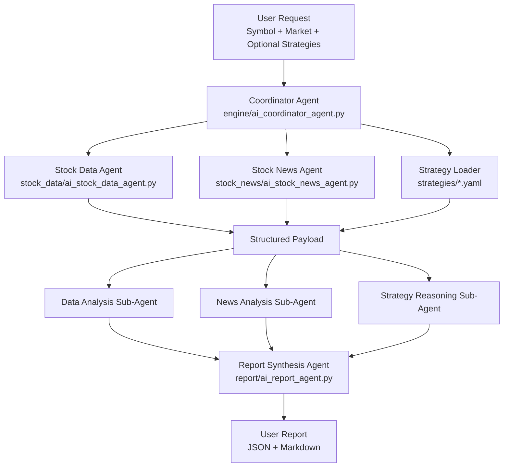

# AI Stock Architecture Draft

## Goal

`ai_stock` is intended to answer a simple user question: given a stock symbol, recent market data, relevant news, and selected trading strategies, what is the most defensible AI-assisted view of the stock right now?

The design target is a multi-agent pipeline:

1. A coordinator agent receives the user request.
2. The coordinator gathers structured context from stock data and stock news agents.
3. The coordinator loads strategy instructions from YAML files.
4. The coordinator assigns focused analysis tasks to specialized sub-agents.
5. A synthesis agent in `report/` combines all intermediate outputs into one user-facing report.

This package should stay explainable. Every conclusion must be traceable back to data, news, and strategy evidence.

## Current State

The current codebase already contains the main building blocks:

- `engine/ai_coordinator_agent.py`: orchestration entry point.
- `stock_data/ai_stock_data_agent.py`: collects historical price, realtime quote, and fundamentals.
- `stock_news/ai_stock_news_agent.py`: collects news and estimates a simple sentiment score.
- `report/ai_report_agent.py`: builds the final response payload and markdown report.
- `strategies/*.yaml`: human-editable strategy definitions and instructions.
- `llm/litellm_client.py`: model client abstraction for future AI-driven sub-agent execution.

Important limitation: the current coordinator does not yet dispatch real LLM sub-agents. It collects context, loads strategies, and falls back to a baseline predictor that uses trend plus news sentiment. The architecture below describes the intended target shape while staying compatible with the current implementation.

## Target Architecture



## Package Responsibilities

| Module | Responsibility | What it should own | What it should not own |
| --- | --- | --- | --- |
| `engine/` | Workflow orchestration | request routing, agent invocation, merging intermediate outputs, failure handling | raw data fetching details, report prose templates, hardcoded strategy logic |
| `stock_data/` | Market data context assembly | provider integration, normalization, freshness metadata, fallback behavior | final trading recommendation |
| `stock_news/` | News context assembly | news retrieval, deduplication, sentiment inputs, event extraction | final trading recommendation |
| `strategies/` | Strategy knowledge base | declarative instructions, priority, activation defaults, regime hints | imperative Python routing logic where YAML is enough |
| `report/` | Final synthesis | summary, confidence explanation, evidence trace, user-facing markdown/JSON | raw provider calls |
| `llm/` | Model access utilities | chat client, token budgeting, model configuration | business decisions about stocks |

## End-To-End Flow

### 1. User input

Minimum request:

- `symbol`
- `market`

Optional request fields:

- `strategy_names`
- `risk_profile`
- `time_horizon`
- `question`

### 2. Coordinator assembles context

The coordinator should build one normalized payload:

```json
{
	"symbol": "600519",
	"market": "cn",
	"stock_data": {
		"history": [],
		"realtime_quote": {},
		"fundamentals": {}
	},
	"stock_news": {
		"news_items": [],
		"sentiment_score": 0
	},
	"strategies": []
}
```

This payload is the system contract between orchestration and analysis. Keep it stable and versionable.

### 3. Coordinator assigns specialized tasks

Target sub-agent split:

- Data analysis sub-agent: determine trend, volatility, support/resistance, abnormal volume, and valuation context.
- News analysis sub-agent: identify material events, sentiment direction, uncertainty, and catalyst timing.
- Strategy reasoning sub-agent: apply selected strategy instructions to the available evidence and explain fit or mismatch.

Each sub-agent should return structured output first, free-form prose second.

Recommended shape:

```json
{
	"summary": "short conclusion",
	"signals": ["signal_a", "signal_b"],
	"risks": ["risk_a"],
	"confidence": 0.72,
	"evidence": [
		{
			"source": "stock_data.history",
			"detail": "close price up 8% over lookback window"
		}
	]
}
```

### 4. Report agent synthesizes the final answer

The report agent should not merely concatenate outputs. It should:

- reconcile disagreements between sub-agents,
- highlight missing or stale evidence,
- explain why a strategy does or does not apply,
- convert technical analysis into a user-readable report,
- keep the final recommendation calibrated to uncertainty.

### 5. User receives one final report

The final report should contain:

- prediction direction: `up`, `down`, or `sideways`
- confidence score
- key reasons
- applied strategies
- data summary
- news summary
- major risks
- invalidation conditions
- optional next actions such as watch, wait, or review again after earnings/news

## Coordinator Design Rules

The coordinator is the most important boundary in this package.

Follow these rules:

1. Keep the coordinator thin. It should orchestrate, not become the place where all analysis logic accumulates.
2. Keep sub-agent interfaces structured. Prefer dictionaries or dataclasses with stable keys over prompt-only free text.
3. Treat strategies as configuration, not code. If a behavior can live in YAML instructions, keep it there.
4. Allow deterministic fallback. If an LLM call fails, the coordinator should still be able to return a reduced but valid report.
5. Preserve provenance. Intermediate outputs should record which data and which strategy influenced the conclusion.
6. Make strategy selection explicit. If a user asks for specific strategies, do not silently replace them unless they are missing.
7. Fail soft on missing providers. Missing data/news integrations should degrade context quality, not crash the whole workflow.

## Sub-Agent Instructions To Follow

These are the implementation rules future AI agents or developers should follow.

### Stock data agent

- Normalize all provider outputs into the existing `StockDataContext` contract.
- Always separate `history`, `realtime_quote`, and `fundamentals`.
- Add freshness metadata if a provider supports timestamps.
- Avoid leaking provider-specific field names into the coordinator payload when a generic field name is possible.
- If multiple providers are available, prefer a provider ranking or fallback chain instead of branching logic scattered through the coordinator.

### Stock news agent

- Normalize every news item into a consistent shape such as title, summary, published_at, source, url, and tags.
- Distinguish between sentiment and materiality. Positive wording is not the same as decision-relevant news.
- When possible, identify event types such as earnings, policy, investigation, product launch, merger, and sector rotation.
- Deduplicate repeated news across providers before scoring.
- Keep the sentiment score explainable. If upgraded later, preserve a simple audit trail.

### Strategy layer

- Use `strategies/*.yaml` as the default place for strategy reasoning instructions.
- Keep `name` stable because the coordinator and user inputs may depend on it.
- Prefer explicit entry, invalidation, and risk rules over vague bullish or bearish language.
- Write strategy instructions so an LLM can produce structured reasoning, not only narrative commentary.
- Keep strategy descriptions market-aware. A CN equity strategy may not transfer cleanly to US symbols.

### Report synthesis agent

- Synthesize contradictions instead of hiding them.
- Use conservative wording when data is thin, stale, or conflicting.
- Separate observed facts from inferred conclusions.
- Keep markdown readable for humans and the full payload parseable for programs.
- Do not overstate certainty. Confidence should reflect evidence quality, not stylistic confidence.

### LLM integration layer

- Keep prompts modular by role: coordinator prompt, data analyst prompt, news analyst prompt, strategy analyst prompt, synthesis prompt.
- Pass compact structured context, not raw dumps, whenever possible.
- Apply token budgeting before model calls.
- Keep model configuration outside business logic.
- Design the system so prompts can evolve without changing the core context contracts.

## Suggested Internal Contracts

### Coordinator request

```python
{
		"symbol": "AAPL",
		"market": "us",
		"strategy_names": ["bull_trend", "event_driven"],
		"question": "Should I watch for a breakout this week?",
}
```

### Coordinator response

```python
{
		"generated_at": "...",
		"symbol": "AAPL",
		"market": "us",
		"prediction": {
				"direction": "up",
				"confidence": 0.68,
				"reason": "..."
		},
		"strategy_names": ["bull_trend", "event_driven"],
		"stock_data": {},
		"stock_news": {},
		"agent_outputs": {
				"data_analysis": {},
				"news_analysis": {},
				"strategy_analysis": {}
		},
		"report_markdown": "..."
}
```

`agent_outputs` does not exist yet in the current implementation, but it should be the next important extension point.

## Implementation Roadmap

### Phase 1: stabilize current baseline

- Keep `AICoordinatorAgent.analyze()` as the single public entry point.
- Preserve the current fallback prediction path.
- Expand normalization and payload shape without breaking existing return fields.

### Phase 2: introduce true sub-agent execution

- Add one coordinator method per analysis role.
- Wire `llm/LitellmClient` into those role-specific sub-agents.
- Make each sub-agent return structured JSON-like content.
- Store intermediate outputs under `agent_outputs`.

### Phase 3: improve synthesis quality

- Upgrade `AIReportAgent` from formatter to reasoning synthesizer.
- Include conflict resolution, caveats, and invalidation levels.
- Add report sections for catalysts, risks, and strategy fit.

### Phase 4: production hardening

- Add provider fallback policy.
- Add caching for repeated symbol analysis.
- Add retries and timeout handling for model calls.
- Add observability for prompt, latency, token cost, and failure type.

## Definition Of Done For Future Changes

A change to `ai_stock` should usually satisfy these conditions:

- the coordinator contract remains stable or is explicitly versioned,
- the report still returns a valid markdown summary,
- missing provider data does not break the full flow,
- selected strategies are reflected in the output,
- intermediate reasoning is explainable,
- new prompts or strategy files do not duplicate logic already owned by another layer.

## Non-Goals

This package should not become:

- a place for hardcoded strategy sprawl inside the coordinator,
- a thin wrapper around one giant prompt with no structured outputs,
- a provider-specific implementation that cannot swap data sources,
- a system that hides uncertainty from the user.

## Recommended Next Implementation Steps

1. Add `agent_outputs` to the coordinator return payload.
2. Create dedicated role methods such as `run_data_analysis()`, `run_news_analysis()`, and `run_strategy_analysis()`.
3. Define one prompt template per role under `llm/` or a new prompt module.
4. Upgrade `AIReportAgent` so it can synthesize intermediate agent outputs instead of only formatting baseline prediction fields.
5. Add tests for strategy loading, payload normalization, and coordinator fallback behavior.

## Notes

- This package is decision-support software, not financial advice.
- Keep outputs auditable, conservative, and evidence-based.
- Prefer architecture that makes future provider swaps and model swaps cheap.
